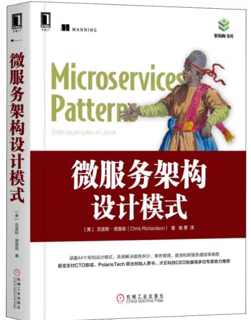

# 微服务架构设计模式

## 目录

[第0章 序言](https://github.com/lemonshen00/reading-record/blob/main/%E5%BE%AE%E6%9C%8D%E5%8A%A1%E6%9E%B6%E6%9E%84%E8%AE%BE%E8%AE%A1%E6%A8%A1%E5%BC%8F/%E7%AC%AC0%E7%AB%A0%20%E5%BA%8F%E8%A8%80/README.md)

[第2章 服务的拆分策略](https://github.com/lemonshen00/reading-record/blob/main/%E5%BE%AE%E6%9C%8D%E5%8A%A1%E6%9E%B6%E6%9E%84%E8%AE%BE%E8%AE%A1%E6%A8%A1%E5%BC%8F/%E7%AC%AC2%E7%AB%A0%20%E6%9C%8D%E5%8A%A1%E7%9A%84%E6%8B%86%E5%88%86%E7%AD%96%E7%95%A5/README.md)

[第3章 微服务架构中的进程间通信](https://github.com/lemonshen00/reading-record/blob/main/%E5%BE%AE%E6%9C%8D%E5%8A%A1%E6%9E%B6%E6%9E%84%E8%AE%BE%E8%AE%A1%E6%A8%A1%E5%BC%8F/%E7%AC%AC3%E7%AB%A0%20%E5%BE%AE%E6%9C%8D%E5%8A%A1%E6%9E%B6%E6%9E%84%E4%B8%AD%E7%9A%84%E8%BF%9B%E7%A8%8B%E9%97%B4%E9%80%9A%E4%BF%A1/README.md)

[第4章 使用Saga管理事务](https://github.com/lemonshen00/reading-record/blob/main/%E5%BE%AE%E6%9C%8D%E5%8A%A1%E6%9E%B6%E6%9E%84%E8%AE%BE%E8%AE%A1%E6%A8%A1%E5%BC%8F/%E7%AC%AC4%E7%AB%A0%20%E4%BD%BF%E7%94%A8Saga%E7%AE%A1%E7%90%86%E4%BA%8B%E5%8A%A1/README.md)

[第5章 微服务架构中的业务逻辑设计](https://github.com/lemonshen00/reading-record/blob/main/%E5%BE%AE%E6%9C%8D%E5%8A%A1%E6%9E%B6%E6%9E%84%E8%AE%BE%E8%AE%A1%E6%A8%A1%E5%BC%8F/%E7%AC%AC5%E7%AB%A0%20%E5%BE%AE%E6%9C%8D%E5%8A%A1%E6%9E%B6%E6%9E%84%E4%B8%AD%E7%9A%84%E4%B8%9A%E5%8A%A1%E9%80%BB%E8%BE%91%E8%AE%BE%E8%AE%A1/README.md)

[第6章 使用事件溯源开发业务逻辑](https://github.com/lemonshen00/reading-record/blob/main/%E5%BE%AE%E6%9C%8D%E5%8A%A1%E6%9E%B6%E6%9E%84%E8%AE%BE%E8%AE%A1%E6%A8%A1%E5%BC%8F/%E7%AC%AC6%E7%AB%A0%20%E4%BD%BF%E7%94%A8%E4%BA%8B%E4%BB%B6%E6%BA%AF%E6%BA%90%E5%BC%80%E5%8F%91%E4%B8%9A%E5%8A%A1%E9%80%BB%E8%BE%91/README.md)

[第7章 在微服务架构中实现查询](https://github.com/lemonshen00/reading-record/blob/main/%E5%BE%AE%E6%9C%8D%E5%8A%A1%E6%9E%B6%E6%9E%84%E8%AE%BE%E8%AE%A1%E6%A8%A1%E5%BC%8F/%E7%AC%AC7%E7%AB%A0%20%E5%9C%A8%E5%BE%AE%E6%9C%8D%E5%8A%A1%E6%9E%B6%E6%9E%84%E4%B8%AD%E5%AE%9E%E7%8E%B0%E6%9F%A5%E8%AF%A2/README.md)

## 关于

***Date***: 31/05/2023 - 

***GitHub***: https://github.com/lemonshen00

***E-Mail***: shenzhiyu00@126.com/happyshenzy@gmail.com

